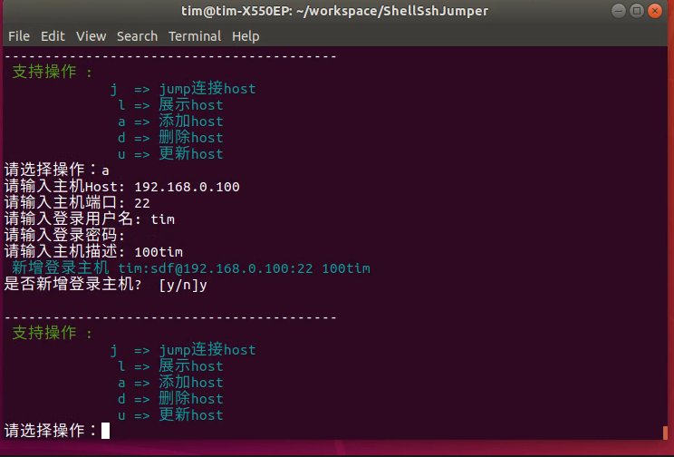

<h1 align="center"><a href='https://github.com/munameiscr7/ShellSshJumper.git' target="_blank" >ShellSshJumper</a></h1>

<p align="center">
A file-based jumpserver ssh login tool written with a shell,it is small compare with other professional jumpserver such as jumperserver etc.
  </br>
It can be used in a general small scenario, suitable for situations where you don't want to install a jumpserver but there are multiple hosts to manage
</p>

<p align="center">
  🇨🇳 <a href="./README.zh-CN.md">中文版介绍</a>
</p>

---

## Features

- Host management: add, delete, update , list and jump
- Sort by number of connections
- Full shell, simplified implementation and dependencies
- simple passwd encryption: Base64 code with passwdsalt head

## Install and useage

```bash
git clone https://github.com/munameiscr7/ShellSshJumper.git

cd ShellSshJumper

bash jump.sh
```

> Tips: Please install expect


>recodeScreen
>>

>addHost
>>

>listHost
>>

>jumpHost
>>


### Instruction
- Linux ssh Login tool
- Support for both secret and key formats
- Both the username and password are saved files (one file per host)
- To use the key, save the key and set the password to the key path. Pay attention to the key permissions


